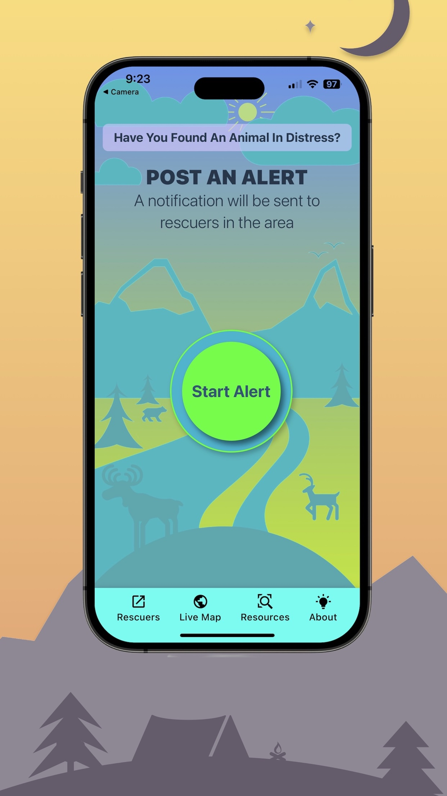
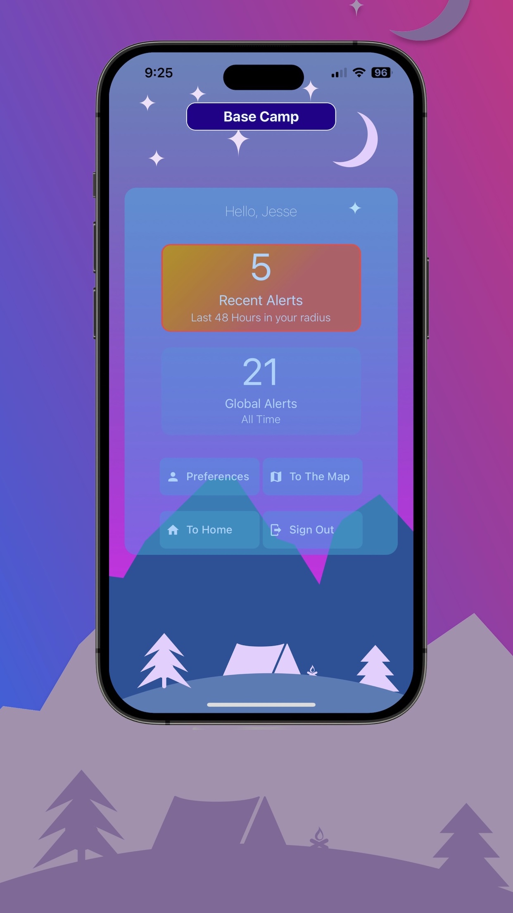
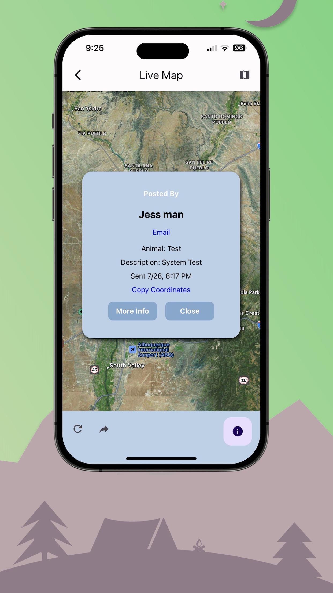

# WildLifeAlert

This passion project aims to ensure that any injured wildlife you encounter doesn't go unnoticed. With a simple alert, you can notify nearby rescue personnel who have the knowledge and experience to provide appropriate help.

## General Technology Info

Includes:
A robust mechanism for persisting data and managing online/offline state with React Query and custom hooks. The app locally stores mutation results and resumes them when back online, allowing users to "post" with no service.

Geoloacation based push notifications with Expo's Notifications API.

Custom made animations and transitions with original artwork.

Stack: Written in TypeScript from front to back using React-Native Expo, Node.js, Docker, EC2, durable Redis Database on AWS, Cloudfront CDN, S3, Application Load Balancer, and Auto-scaling spot-instances for cost efficient scaling based on demand.

## Status

The project is deployed to the Apple AppStore and Google PlayStore. The primary focus for development is to inform users of the app's existence and to increase the number of active users.

## Project Home Page

(https://wildlifealertusa.com)

## Screenshots

Home Screen 

 

<kbd>

</kbd>

 

Rescuer Dashboard

 

<kbd>

</kbd>
 

Map View of an Alert

 

<kbd>

</kbd>

 
 
 

## Contact

Created by [Jesse Hall](https://www.linkedin.com/in/jessehall/)
Feel free to contact me for any questions!
